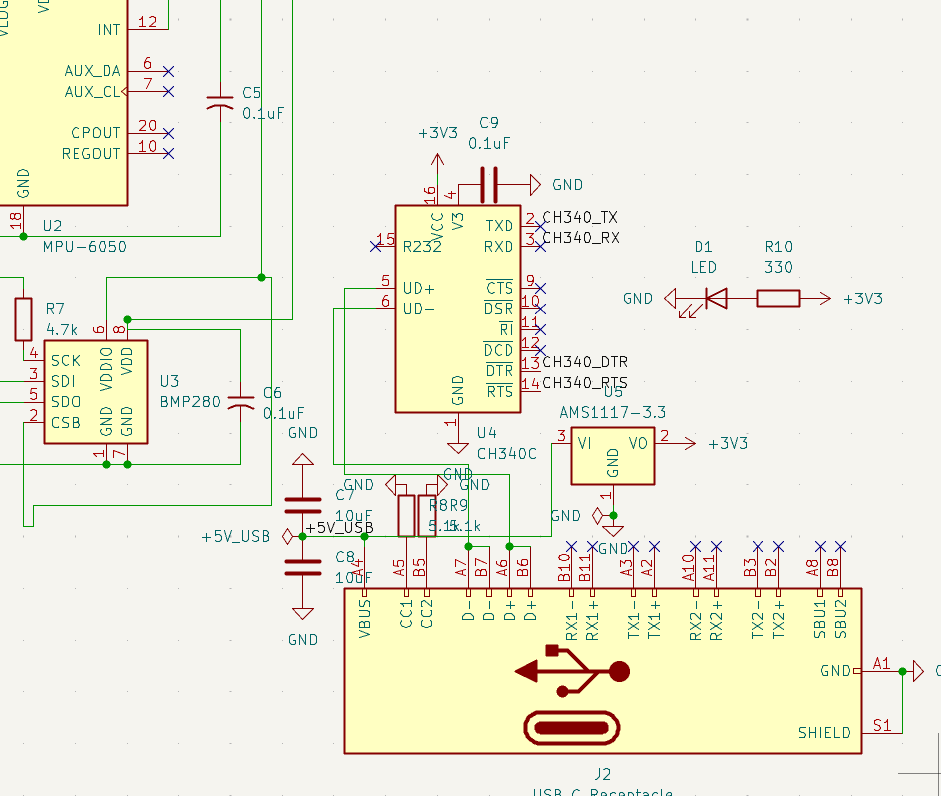
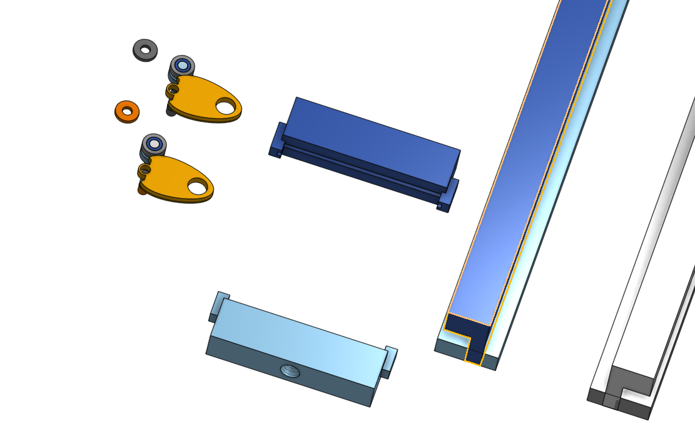
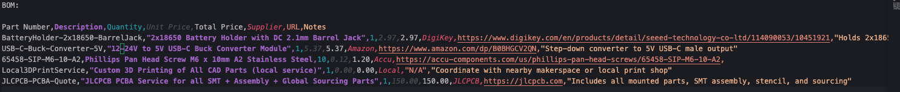
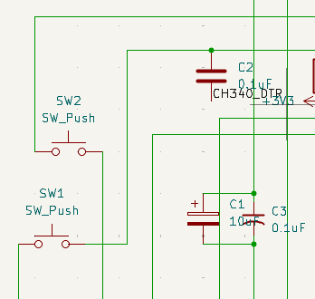
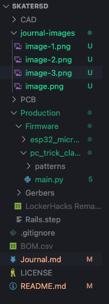

## Journal: This is where I post all updates!

# Total time spent:
~24.5 (24 if you want exact numbers (rounding down for convenience))

# Day 1:
6/7/25
~ 4.5 hrs
I made some CAD stuff in OnShape, I made the rails and the hinge with wheels, this took a while in OnShape and is pretty much the textbook definition of "harder than it looks". I also decided on my parts and full design. I had to measure and look at different screws before coming to a conclusion, I also measured my skateboard dimensions exactly and did a lot of math.   

# Day 2:
6/8/25
~ 5.25 hrs
I made the entire schematic with a bunch of tweaks and stuff, I also assigned the footprints. The main issue was getting the perfect parts and doing a lot more research on the perfect footprints. I also planned how the PCB is going to look so later I can get work done really fast.  
 I also made a lot of edits with the wiring to make sure that I could access all the sensors properly. I looked through a lot of documentation to make sure that everything was in the right place and the wires were meant to be and I had to add pullups and capacitors in the right place or everything would be absolutely fried when I put it together.

# Day 3:
6/9/25
~ 5.75 hrs
A LOT of schematic reworking and error solving. I had to go back into the schematic multiple times to fix wiring issues and voltage logic problems. After that I moved on to the PCB design, but that also went through a bunch of reworks — spacing, trace width, pad clearance issues, component repositioning. It took forever to get it clean and actually manufacturable, and every small fix led to new issues somewhere else. Mentally draining but productive.

# Day 4:
6/10/25
~ 4 hrs
Today was CAD-heavy. I improved the rail design and made the mount for the PCB after exporting the 3D model from the board. Of course, with CAD comes math — and I had to revise a bunch of my earlier measurements because they were slightly off. I added more components to the PCB including LEDs and switches, and started working on the BOM (not completed yet). Overall, it’s starting to feel like a real system now.

To complete:
	•	BOM
	•	Firmware
	•	CAD with math (a little revisions to do since my calculations were off)
    •   Formatting the files to match the normal format

# Day 5:
6/11/25
~ 5 hrs
Today marks the final official day of this sprint, and honestly, it feels both satisfying and slightly open-ended — like there’s more to chase, which I kind of like.

What I Did Today
	•	Switched from mock code to real code for my skateboard motion classifier
	•	Set up the MicroPython script on the ESP32-S3 Mini-1 to stream real-time data from the MPU6050 sensor
	•	Built the full PC-side classifier using fastdtw, NumPy, and matplotlib to detect tricks from motion patterns
	•	Planned out how I’ll record ollie/kickflip patterns for training
    •	Formatted all files to the proper format for a standard project

Even though I don’t have the physical hardware yet, I now have a fully working pipeline from board → sensor → ESP32 → serial → real-time visualization → classification.

What I Learned
	•	How to structure embedded + host code together in a real hardware project
	•	That real-time classification is way more intuitive when you can visualize the data
	•	That using DTW to match time-series patterns actually works better than I expected
	•	The small details (like loading different .npy files or managing buffer sizes) really matter in signal-based ML

# I dont have screenshots for this day, because it is the firmware, go into the production folder and then see firmware, it is all located inside of there!

TL;DR:
On Day 5, I wrapped up the core pipeline for my ESP32-based skateboard classifier. Even without hardware, I now have real code working end-to-end — this week taught me way more than just coding. When the PCBA arrives and I 3D print everything ill continue this journal, submitting to highway for now! I also have to tweak the /Users/samhithpola/Documents/GitHub/Skater5D/Production/Firmware/pc_trick_classifier/main.py file because it works for the raspberry pi, not the ESP32 S3 Mini-1, easy fix though!

# Day 6
~ 4 hrs
Sadly not building today (A lot of parts will arrive today though) but I decided to fix the schematic using net labels, and changed the sensor models. My BMP and MPU sensors are now a ToF sensor instead of the BMP because I figured that works better for small changes in distance from the ground and the barometric pressure barely changes when you move only 1mm upwards. I also decided to change the MPU sensor to a better one which is the BNO08X and this would make things cheaper and more reliable. And I am using breakout boards from AdaFruit this way I can actually solder things and not have to do PCBA so I can save hackclubs money and my time and brain cells. I also updated the PCB layout to have 90 degree angle brackets for the TOF sensor and changed the overall layout. Using breakout boards meant I saved a lot of time this time around, and luckily I did not order parts from my old design yet except for 1 which I can still use with this design.

(Ignore the label saying OLED LCD 1X16, that is supposed to be a character LCD I just gave it a very scuffed name)

I also edited the CAD to fit the new PCB dimensions.

Overall these changes should be what I am ordering from JLCPCB and the external parts that I am ordering. The entire thing is refactored to be a lot better in general.
